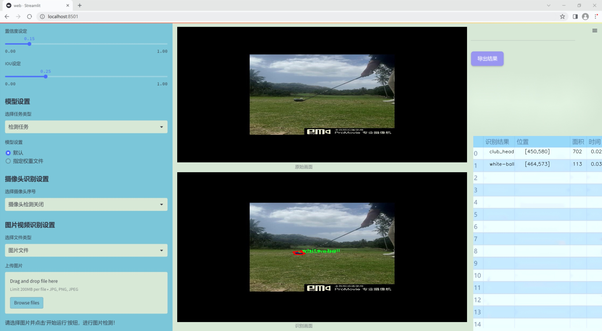
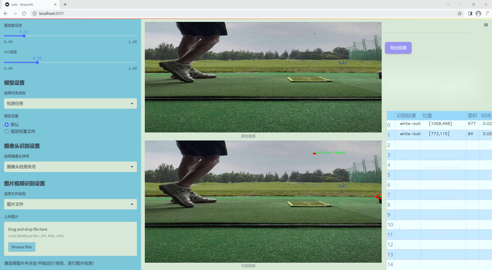
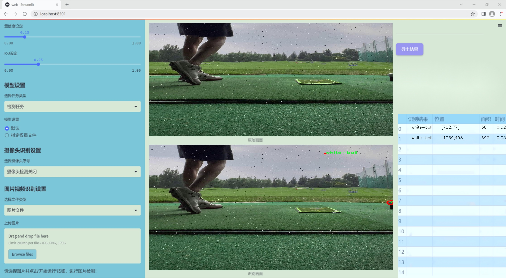
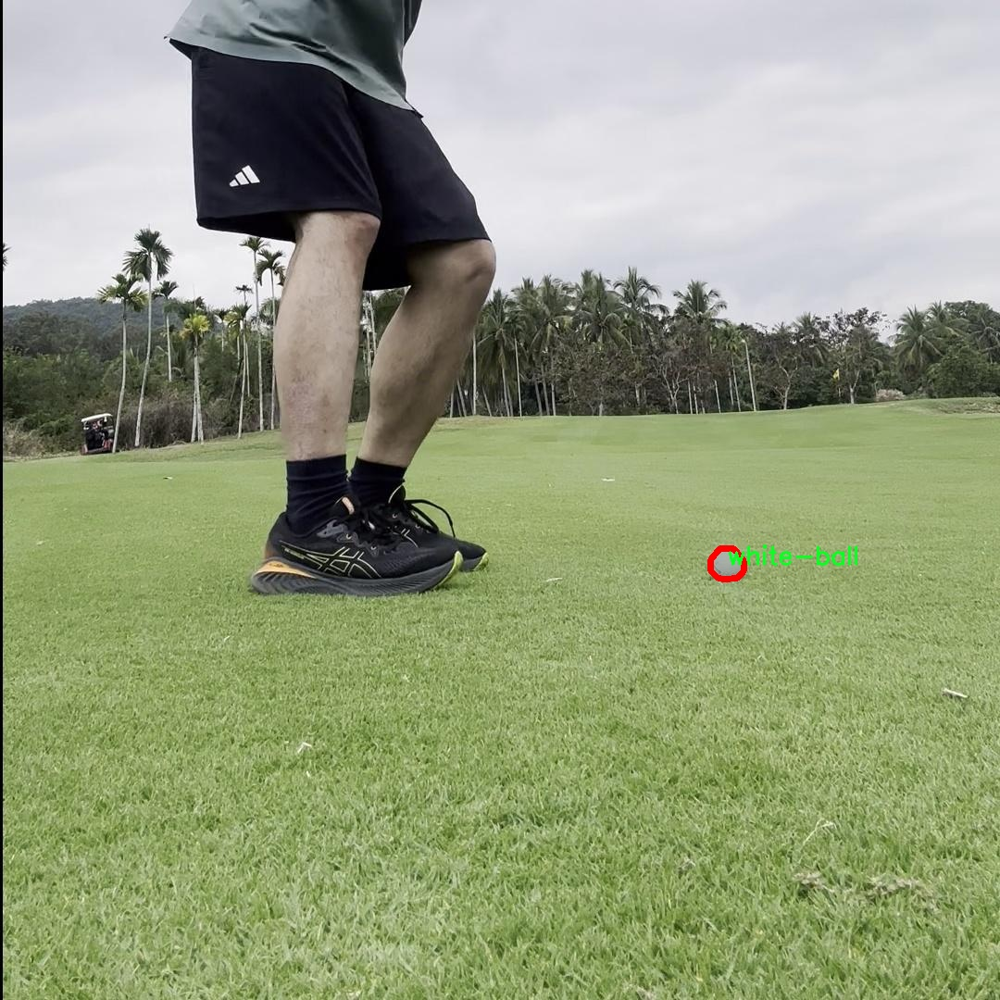

### 1.背景意义

研究背景与意义

高尔夫运动作为一项广受欢迎的休闲和竞技活动，吸引了大量的参与者和观众。随着科技的进步，尤其是计算机视觉和深度学习技术的发展，如何利用这些技术来提升高尔夫运动的训练和观赏体验，成为了一个重要的研究方向。高尔夫球的追踪与识别不仅能够帮助运动员分析自己的击球技术，还能为教练提供更为精准的数据支持，从而制定个性化的训练方案。此外，借助先进的视觉识别系统，赛事转播也能够更加生动地展示比赛过程，提升观众的观看体验。

在此背景下，基于改进YOLOv11的高尔夫球追踪与识别系统应运而生。YOLO（You Only Look Once）系列模型以其高效的实时检测能力和优越的准确性，在物体检测领域中得到了广泛应用。通过对YOLOv11的改进，结合特定的高尔夫球数据集，我们能够实现对高尔夫球及其相关物体（如球杆、不同颜色的高尔夫球等）的高效识别与追踪。该数据集包含2600张图像，涵盖了四个主要类别：球杆、白色高尔夫球、黄色高尔夫球和小型高尔夫球。这些数据的丰富性和多样性为模型的训练提供了坚实的基础。

通过对高尔夫球的精准追踪与识别，不仅可以提升运动员的训练效果，还能为高尔夫赛事的智能化转播提供技术支持，推动高尔夫运动的数字化转型。此外，该系统的成功应用也为其他运动项目的物体检测与追踪提供了借鉴，具有广泛的应用前景和研究价值。因此，基于改进YOLOv11的高尔夫球追踪与识别系统的研究，不仅具有重要的学术意义，也将为高尔夫运动的未来发展注入新的活力。

### 2.视频效果

[2.1 视频效果](https://www.bilibili.com/video/BV1SsBMYGEfk/)

### 3.图片效果







##### [项目涉及的源码数据来源链接](https://kdocs.cn/l/cszuIiCKVNis)**

注意：本项目提供训练的数据集和训练教程,由于版本持续更新,暂不提供权重文件（best.pt）,请按照6.训练教程进行训练后实现上图演示的效果。

### 4.数据集信息

##### 4.1 本项目数据集类别数＆类别名

nc: 4
names: ['club_head', 'small-ball', 'white-ball', 'yellow-ball']


该项目为【图像分割】数据集，请在【训练教程和Web端加载模型教程（第三步）】这一步的时候按照【图像分割】部分的教程来训练

##### 4.2 本项目数据集信息介绍

本项目数据集信息介绍

本项目所使用的数据集旨在支持高尔夫球追踪与识别系统的训练，特别是针对改进YOLOv11模型的应用。数据集的主题为“golf-tracking-with-color 2”，专注于高尔夫运动中关键物体的检测与识别。该数据集包含四个主要类别，分别是“club_head”（球杆头）、“small-ball”（小球）、“white-ball”（白色球）和“yellow-ball”（黄色球）。这些类别的选择反映了高尔夫运动中常见的物体，能够有效地帮助模型学习和识别不同类型的高尔夫球及其相关装备。

在数据集的构建过程中，充分考虑了高尔夫运动的实际场景，确保数据的多样性和代表性。数据集中包含了不同光照条件、角度和背景下的图像，以提高模型在真实环境中的鲁棒性。每个类别的样本数量经过精心设计，以确保模型在训练过程中能够获得均衡的学习机会，从而提高其对各类物体的识别准确性。

此外，数据集还包含了丰富的标注信息，确保每个图像中的目标物体都被准确标记。这种高质量的标注不仅有助于模型的训练，也为后续的性能评估提供了可靠的依据。通过使用这一数据集，研究团队希望能够显著提升YOLOv11在高尔夫球追踪与识别任务中的表现，使其在实际应用中能够更精准地识别和追踪高尔夫球及其相关装备，从而为高尔夫运动的分析和研究提供更为强大的技术支持。





### 5.全套项目环境部署视频教程（零基础手把手教学）

[5.1 所需软件PyCharm和Anaconda安装教程（第一步）](https://www.bilibili.com/video/BV1BoC1YCEKi/?spm_id_from=333.999.0.0&vd_source=bc9aec86d164b67a7004b996143742dc)


[5.2 安装Python虚拟环境创建和依赖库安装视频教程（第二步）](https://www.bilibili.com/video/BV1ZoC1YCEBw?spm_id_from=333.788.videopod.sections&vd_source=bc9aec86d164b67a7004b996143742dc)

### 6.改进YOLOv11训练教程和Web_UI前端加载模型教程（零基础手把手教学）

[6.1 改进YOLOv11训练教程和Web_UI前端加载模型教程（第三步）](https://www.bilibili.com/video/BV1BoC1YCEhR?spm_id_from=333.788.videopod.sections&vd_source=bc9aec86d164b67a7004b996143742dc)


按照上面的训练视频教程链接加载项目提供的数据集，运行train.py即可开始训练



     Epoch   gpu_mem       box       obj       cls    labels  img_size
     1/200     20.8G   0.01576   0.01955  0.007536        22      1280: 100%|██████████| 849/849 [14:42<00:00,  1.04s/it]
               Class     Images     Labels          P          R     mAP@.5 mAP@.5:.95: 100%|██████████| 213/213 [01:14<00:00,  2.87it/s]
                 all       3395      17314      0.994      0.957      0.0957      0.0843

     Epoch   gpu_mem       box       obj       cls    labels  img_size
     2/200     20.8G   0.01578   0.01923  0.007006        22      1280: 100%|██████████| 849/849 [14:44<00:00,  1.04s/it]
               Class     Images     Labels          P          R     mAP@.5 mAP@.5:.95: 100%|██████████| 213/213 [01:12<00:00,  2.95it/s]
                 all       3395      17314      0.996      0.956      0.0957      0.0845

     Epoch   gpu_mem       box       obj       cls    labels  img_size
     3/200     20.8G   0.01561    0.0191  0.006895        27      1280: 100%|██████████| 849/849 [10:56<00:00,  1.29it/s]
               Class     Images     Labels          P          R     mAP@.5 mAP@.5:.95: 100%|███████   | 187/213 [00:52<00:00,  4.04it/s]
                 all       3395      17314      0.996      0.957      0.0957      0.0845


###### [项目数据集下载链接](https://kdocs.cn/l/cszuIiCKVNis)

### 7.原始YOLOv11算法讲解

YOLOv11是一种由Ultralytics公司开发的最新一代目标检测模型，以其增强的特征提取能力和更高的效率在计算机视觉领域引人注目。该模型在架构上进行了关键升级，通过更新主干和颈部结构，显著提高了对复杂视觉场景的理解和处理精度。YOLOv11不仅在目标检测上表现出色，还支持实例分割、图像分类、姿态估计和定向目标检测（OBB）等任务，展示出其多功能性。

与其前身YOLOv8相比，YOLOv11在设计上实现了深度和宽度的改变，同时引入了几个创新机制。其中，C3k2机制是对YOLOv8中的C2f的改进，提升了浅层特征的处理能力；C2PSA机制则进一步优化了特征图的处理流程。解耦头的创新设计，通过增加两个深度卷积（DWConv），提高了模型对细节的感知能力和分类准确性。

在性能上，YOLOv11m模型在COCO数据集上的平均精度（mAP）提高，并减少了22%的参数量，确保了在运算效率上的突破。该模型可以部署在多种平台上，包括边缘设备、云平台以及支持NVIDIA GPU的系统，彰显出卓越的灵活性和适应性。总体而言，YOLOv11通过一系列的创新突破，对目标检测领域产生了深远的影响，并为未来的开发提供了新的研究方向。


****文档**** ： _ _https://docs.ultralytics.com/models/yolo11/__

****代码链接**** ： _ _https://github.com/ultralytics/ultralytics__

******Performance Metrics******


​ ** **关键特性****

****◆**** ** **增强的特征提取能力**** ：YOLO11采用了改进的主干和颈部架构，增强了 ** **特征提取****
能力，能够实现更精确的目标检测和复杂任务的执行。

****◆**** ** **优化的效率和速度****
：YOLO11引入了精细化的架构设计和优化的训练流程，提供更快的处理速度，并在准确性和性能之间保持最佳平衡。

****◆**** ** **参数更少、精度更高****
：通过模型设计的改进，YOLO11m在COCO数据集上实现了更高的平均精度（mAP），同时使用的参数比YOLOv8m少22%，使其在计算上更加高效，而不牺牲准确性。

****◆**** ** **跨环境的适应性**** ：YOLO11可以无缝部署在各种环境中，包括边缘设备、云平台和支持NVIDIA
GPU的系统，确保最大的灵活性。

****◆**** ** **支持广泛任务****
：无论是目标检测、实例分割、图像分类、姿态估计还是定向目标检测（OBB），YOLO11都旨在应对一系列计算机视觉挑战。

****支持的任务和模式****


​YOLO11建立在YOLOv8中引入的多功能模型范围之上，为各种计算机视觉任务提供增强的支持:


​该表提供了YOLO11模型变体的概述，展示了它们在特定任务中的适用性以及与Inference、Validation、Training和Export等操作模式的兼容性。从实时检测到复杂的分割任务
，这种灵活性使YOLO11适用于计算机视觉的广泛应用。

##### yolov11的创新

■ yolov8 VS yolov11

YOLOv5，YOLOv8和YOLOv11均是ultralytics公司的作品，ultralytics出品必属精品。


​ **具体创新点** ：

**① 深度（depth）和宽度 （width）**

YOLOv8和YOLOv11是基本上完全不同。

**② C3k2机制**

C3k2有参数为c3k，其中在网络的浅层c3k设置为False。C3k2就相当于YOLOv8中的C2f。


​ **③ C2PSA机制**

下图为C2PSA机制的原理图。


​ **④ 解耦头**

解耦头中的分类检测头增加了两个 **DWConv** 。


▲Conv

    
    
    def autopad(k, p=None, d=1):  # kernel, padding, dilation
    
        """Pad to 'same' shape outputs."""
    
        if d > 1:
    
            k = d * (k - 1) + 1 if isinstance(k, int) else [d * (x - 1) + 1 for x in k]  # actual kernel-size
    
        if p is None:
    
            p = k // 2 if isinstance(k, int) else [x // 2 for x in k]  # auto-pad
    
    return p
    
    
    class Conv(nn.Module):
    
        """Standard convolution with args(ch_in, ch_out, kernel, stride, padding, groups, dilation, activation)."""
    
    
        default_act = nn.SiLU()  # default activation
    
    
        def __init__(self, c1, c2, k=1, s=1, p=None, g=1, d=1, act=True):
    
            """Initialize Conv layer with given arguments including activation."""
    
            super().__init__()
    
            self.conv = nn.Conv2d(c1, c2, k, s, autopad(k, p, d), groups=g, dilation=d, bias=False)
    
            self.bn = nn.BatchNorm2d(c2)
    
            self.act = self.default_act if act is True else act if isinstance(act, nn.Module) else nn.Identity()
    
    
        def forward(self, x):
    
            """Apply convolution, batch normalization and activation to input tensor."""
    
            return self.act(self.bn(self.conv(x)))
    
    
        def forward_fuse(self, x):
    
            """Perform transposed convolution of 2D data."""
    
            return self.act(self.conv(x))

▲Conv2d

    
    
    torch.nn.Conv2d(in_channels, out_channels, kernel_size, stride=1, padding=0, dilation=1, groups=1, bias=True, padding_mode='zeros')

▲DWConv

DWConv ** **代表 Depthwise Convolution（深度卷积）****
，是一种在卷积神经网络中常用的高效卷积操作。它主要用于减少计算复杂度和参数量。

    
    
    class DWConv(Conv):
    
        """Depth-wise convolution."""
    
    
        def __init__(self, c1, c2, k=1, s=1, d=1, act=True):  # ch_in, ch_out, kernel, stride, dilation, activation
    
            """Initialize Depth-wise convolution with given parameters."""
    
            super().__init__(c1, c2, k, s, g=math.gcd(c1, c2), d=d, act=act)


### 8.200+种全套改进YOLOV11创新点原理讲解

#### 8.1 200+种全套改进YOLOV11创新点原理讲解大全

由于篇幅限制，每个创新点的具体原理讲解就不全部展开，具体见下列网址中的改进模块对应项目的技术原理博客网址【Blog】（创新点均为模块化搭建，原理适配YOLOv5~YOLOv11等各种版本）

[改进模块技术原理博客【Blog】网址链接](https://gitee.com/qunmasj/good)


#### 8.2 精选部分改进YOLOV11创新点原理讲解

###### 这里节选部分改进创新点展开原理讲解(完整的改进原理见上图和[改进模块技术原理博客链接](https://gitee.com/qunmasj/good)【如果此小节的图加载失败可以通过CSDN或者Github搜索该博客的标题访问原始博客，原始博客图片显示正常】

### ParC融合位置感知循环卷积简介
ParC：Position aware circular convolution


#### Position aware circular convolution
针对于全局信息的提取作者提出了Position aware circular convolution（也称作Global Circular Convolution）。图中左右实际是对于该操作水平竖直两方向的对称，理解时只看左边即可。对于维度为C*H*W的输入，作者先将维度为C*B*1的Position Embedding通过双线性插值函数F调整到适合input的维度C*H*1（以适应不同特征大小输入），并且将PE水平复制扩展到C*H*W维度与输入特征相加。这里作者将PE直接设置成为了可学习的参数。

接下来参考该博客将加入PE的特征图竖直方向堆叠，并且同样以插值的方式得到了适应输入维度的C*H*1大小的卷积核，进行卷积操作。对于这一步卷积，作者将之称为循环卷积，并给出了一个卷积示意图。


但个人感觉实际上这个示意图只是为了说明为什么叫循环卷积，对于具体的计算细节还是根据公式理解更好。


进一步，作者给出了这一步的伪代码来便于读者对这一卷积的理解：y=F.conv2D（torch.cat（xp，xp，dim=2），kV），实际上就是将xp堆叠之后使用了一个“条形（或柱形）”卷积核进行简单的卷积操作。（但这样会导致多一次重复卷积，因此在堆叠示意图中只取了前2*H-1行）

可以看到在示意图中特征维度变化如下：C*(2H-1)*W ---C*H*1--->C*H*W，作者特意带上了通道数，并且并没有出现通道数的改变，那么这里所进行的卷积应该是depth wise卷积，通过对文章后续以及论文源码的阅读可以得知这一步进行的就是DW卷积。（we introduce group convolution and point wise convolution into these modules, which decreases number of parameters without hurting performance.）


由groups = channel可知使用的是DW卷积
通过上面就完成了一次竖直方向的全局信息交流，同样只要在水平方向进行同样的操作即可做到水平方向的全局信息交流。

#### ParC block

通过ParC成功解决了全局信息提取的问题，接下来就是针对2）3）两点进行改进。首先是Meta-Former模块，Meta-Former由Token Mixer和Channel Mixer构成，ParC首先满足了Token Mixer的全局信息提取的要求，并且相较于Attention在计算成本上更低。


这里①中的PWC即point wise conv，进一步验证了我们前面对于深度可分离卷积的想法，而GCC-H/V即是前面所说的ParC-H/V。

①构建了Meta-Former中的Token mixer模块，那么最后剩下的问题就是3），替换掉Attention模块之后模型不再data driven。为了解决这一点作者给出了一个channel wise attention，先将特征图（x,C*H*W）进行global average（a,C*1*1）并输入一个MLP生成一个channel wise的权重（w,C*1*1），再将权重与特征图在通道方向相乘得到输出（output = wx,C*H*W）。

#### ParC net
对于ParC net 的搭建，作者直接基于MobileViT，采用了分叉结构（c）完成了网络的搭建。


具体而言作者保留了MobileViT中浅层具有局部感受野的MobileNetV2结构，而将网络深层的ViT block替换成了ParC block，使网络变成了一个pure ConvNet。


### 9.系统功能展示

图9.1.系统支持检测结果表格显示

  图9.2.系统支持置信度和IOU阈值手动调节

  图9.3.系统支持自定义加载权重文件best.pt(需要你通过步骤5中训练获得)

  图9.4.系统支持摄像头实时识别

  图9.5.系统支持图片识别

  图9.6.系统支持视频识别

  图9.7.系统支持识别结果文件自动保存

  图9.8.系统支持Excel导出检测结果数据


### 10. YOLOv11核心改进源码讲解

#### 10.1 mamba_yolo.py

以下是对代码中最核心部分的提取和详细注释。代码主要涉及深度学习中的一些模块，特别是与选择性扫描（Selective Scan）和层归一化（Layer Normalization）相关的部分。

```python
import torch
import torch.nn as nn
from einops import rearrange

class LayerNorm2d(nn.Module):
    """自定义的二维层归一化模块"""
    
    def __init__(self, normalized_shape, eps=1e-6, elementwise_affine=True):
        super().__init__()
        # 使用PyTorch的LayerNorm进行归一化
        self.norm = nn.LayerNorm(normalized_shape, eps, elementwise_affine)

    def forward(self, x):
        # 将输入的形状从 (B, C, H, W) 转换为 (B, H, W, C)
        x = rearrange(x, 'b c h w -> b h w c').contiguous()
        # 进行归一化
        x = self.norm(x)
        # 再将形状转换回 (B, C, H, W)
        x = rearrange(x, 'b h w c -> b c h w').contiguous()
        return x


class CrossScan(torch.autograd.Function):
    """交叉扫描操作的自定义前向和反向函数"""
    
    @staticmethod
    def forward(ctx, x: torch.Tensor):
        B, C, H, W = x.shape
        ctx.shape = (B, C, H, W)
        # 创建一个新的张量用于存储交叉扫描的结果
        xs = x.new_empty((B, 4, C, H * W))
        # 将输入张量展平并进行转置
        xs[:, 0] = x.flatten(2, 3)
        xs[:, 1] = x.transpose(dim0=2, dim1=3).flatten(2, 3)
        # 进行翻转操作
        xs[:, 2:4] = torch.flip(xs[:, 0:2], dims=[-1])
        return xs

    @staticmethod
    def backward(ctx, ys: torch.Tensor):
        B, C, H, W = ctx.shape
        L = H * W
        # 反向传播时对输出进行处理
        ys = ys[:, 0:2] + ys[:, 2:4].flip(dims=[-1]).view(B, 2, -1, L)
        y = ys[:, 0] + ys[:, 1].view(B, -1, W, H).transpose(dim0=2, dim1=3).contiguous().view(B, -1, L)
        return y.view(B, -1, H, W)


class SelectiveScanCore(torch.autograd.Function):
    """选择性扫描核心操作的自定义前向和反向函数"""
    
    @staticmethod
    @torch.cuda.amp.custom_fwd
    def forward(ctx, u, delta, A, B, C, D=None, delta_bias=None, delta_softplus=False, nrows=1, backnrows=1):
        # 确保输入是连续的
        if u.stride(-1) != 1:
            u = u.contiguous()
        if delta.stride(-1) != 1:
            delta = delta.contiguous()
        if D is not None and D.stride(-1) != 1:
            D = D.contiguous()
        if B.stride(-1) != 1:
            B = B.contiguous()
        if C.stride(-1) != 1:
            C = C.contiguous()
        
        # 处理维度
        if B.dim() == 3:
            B = B.unsqueeze(dim=1)
            ctx.squeeze_B = True
        if C.dim() == 3:
            C = C.unsqueeze(dim=1)
            ctx.squeeze_C = True
        
        ctx.delta_softplus = delta_softplus
        ctx.backnrows = backnrows
        
        # 调用CUDA核心的前向函数
        out, x, *rest = selective_scan_cuda_core.fwd(u, delta, A, B, C, D, delta_bias, delta_softplus, 1)
        ctx.save_for_backward(u, delta, A, B, C, D, delta_bias, x)
        return out

    @staticmethod
    @torch.cuda.amp.custom_bwd
    def backward(ctx, dout, *args):
        u, delta, A, B, C, D, delta_bias, x = ctx.saved_tensors
        if dout.stride(-1) != 1:
            dout = dout.contiguous()
        # 调用CUDA核心的反向函数
        du, ddelta, dA, dB, dC, dD, ddelta_bias, *rest = selective_scan_cuda_core.bwd(
            u, delta, A, B, C, D, delta_bias, dout, x, ctx.delta_softplus, 1
        )
        return (du, ddelta, dA, dB, dC, dD, ddelta_bias, None, None, None, None)


def cross_selective_scan(x: torch.Tensor, x_proj_weight: torch.Tensor, dt_projs_weight: torch.Tensor, A_logs: torch.Tensor, Ds: torch.Tensor, out_norm: nn.Module = None):
    """执行交叉选择性扫描的主函数"""
    
    B, D, H, W = x.shape
    L = H * W

    # 进行交叉扫描
    xs = CrossScan.apply(x)

    # 进行投影
    x_dbl = torch.einsum("b k d l, k c d -> b k c l", xs, x_proj_weight)
    dts, Bs, Cs = torch.split(x_dbl, [R, N, N], dim=2)
    dts = torch.einsum("b k r l, k d r -> b k d l", dts, dt_projs_weight)

    # HiPPO矩阵
    As = -torch.exp(A_logs.to(torch.float))  # (k * c, d_state)
    Bs = Bs.contiguous()
    Cs = Cs.contiguous()
    Ds = Ds.to(torch.float)  # (K * c)

    # 执行选择性扫描
    ys: torch.Tensor = SelectiveScan.apply(xs, dts, As, Bs, Cs, Ds)
    y: torch.Tensor = CrossMerge.apply(ys)

    # 进行输出归一化
    if out_norm is not None:
        y = out_norm(y.view(B, -1, H, W)).view(B, H, W, -1)

    return y


class SS2D(nn.Module):
    """SS2D模块，结合选择性扫描和卷积操作"""
    
    def __init__(self, d_model=96, d_state=16, ssm_ratio=2.0, ssm_rank_ratio=2.0, act_layer=nn.SiLU, dropout=0.0):
        super().__init__()
        self.in_proj = nn.Conv2d(d_model, d_model * ssm_ratio, kernel_size=1)
        self.out_proj = nn.Conv2d(d_model * ssm_ratio, d_model, kernel_size=1)
        self.dropout = nn.Dropout(dropout) if dropout > 0. else nn.Identity()

    def forward(self, x: torch.Tensor):
        x = self.in_proj(x)
        x = cross_selective_scan(x, self.x_proj_weight, self.dt_projs_weight, self.A_logs, self.Ds)
        x = self.out_proj(x)
        return self.dropout(x)
```

### 代码核心部分分析
1. **LayerNorm2d**: 自定义的二维层归一化模块，主要用于对输入的特征图进行归一化处理，以提高模型的训练稳定性和收敛速度。

2. **CrossScan**: 自定义的交叉扫描操作，负责将输入的特征图进行不同方向的展平和翻转，以便后续的处理。

3. **SelectiveScanCore**: 实现选择性扫描的核心功能，包含前向和反向传播的逻辑，利用CUDA加速计算。

4. **cross_selective_scan**: 主函数，负责执行交叉选择性扫描的整体流程，包括特征的投影和归一化。

5. **SS2D**: 结合选择性扫描和卷积操作的模块，能够在特征提取的过程中引入选择性扫描的机制，以提高模型的表达能力。

以上代码展示了深度学习模型中复杂的操作，特别是在特征处理和归一化方面的实现。

该文件 `mamba_yolo.py` 是一个实现 YOLO（You Only Look Once）目标检测模型的 PyTorch 模块，包含了多个神经网络组件和自定义操作。以下是对文件中主要部分的逐步分析和说明。

首先，文件导入了一些必要的库，包括 PyTorch、数学运算库、以及一些用于深度学习的工具库。特别是 `torch.nn` 用于构建神经网络层，`einops` 用于张量重排，`timm.layers` 提供了一些常用的层。

接下来，定义了一个 `LayerNorm2d` 类，它是对二维数据进行层归一化的实现。该类的 `forward` 方法通过调整张量的维度顺序来实现归一化操作，确保输入数据的形状适合层归一化。

然后，定义了一个 `autopad` 函数，用于自动计算卷积操作的填充，以保持输出形状与输入形状相同。

接下来是 `CrossScan` 和 `CrossMerge` 类，它们是自定义的 PyTorch 自动求导函数。`CrossScan` 类实现了一个前向和反向传播的操作，用于处理输入张量的交叉扫描，而 `CrossMerge` 类则负责将多个输入合并成一个输出。

`SelectiveScanCore` 类实现了选择性扫描的核心功能，允许在前向和反向传播中使用自定义的 CUDA 操作，以提高计算效率。该类的 `forward` 和 `backward` 方法分别实现了前向和反向传播的逻辑。

`cross_selective_scan` 函数是一个高层次的接口，结合了多个输入参数，执行选择性扫描操作并返回结果。它允许用户指定不同的参数以调整扫描的行为。

接下来是 `SS2D` 类，它是一个实现了 S4D（State Space for Sequence Modeling）模型的模块。该类的构造函数定义了输入和输出的维度、卷积层、投影层等，并包含了多种初始化方法以便于模型的训练。

`RGBlock` 和 `LSBlock` 类是两个不同的模块，分别实现了不同的网络结构。`RGBlock` 主要通过卷积层和激活函数进行特征提取，而 `LSBlock` 则结合了卷积和批归一化操作，增强了模型的表达能力。

`XSSBlock` 和 `VSSBlock_YOLO` 类是 YOLO 模型的核心组件，结合了选择性扫描和其他操作，处理输入特征并生成输出。它们通过不同的层次结构实现了特征的融合和变换。

`SimpleStem` 类是模型的输入层，负责将输入图像转换为适合后续处理的特征表示。它使用了多层卷积和激活函数。

最后，`VisionClueMerge` 类用于合并特征图，通过对输入特征进行下采样和卷积操作，生成最终的输出特征。

总体而言，该文件实现了一个复杂的深度学习模型，结合了多种自定义操作和网络结构，旨在提高目标检测任务的性能。每个类和函数都经过精心设计，以便在训练和推理过程中高效地处理数据。

#### 10.2 cfpt.py

以下是保留的核心代码部分，并附上详细的中文注释：

```python
import torch
import torch.nn as nn
import torch.nn.functional as F

class CrossLayerPosEmbedding3D(nn.Module):
    def __init__(self, num_heads=4, window_size=(5, 3, 1), spatial=True):
        super(CrossLayerPosEmbedding3D, self).__init__()
        self.spatial = spatial  # 是否使用空间位置嵌入
        self.num_heads = num_heads  # 注意力头的数量
        self.layer_num = len(window_size)  # 层数
        # 初始化相对位置偏置表
        self.relative_position_bias_table = nn.Parameter(
            torch.zeros((2 * window_size[0] - 1) * (2 * window_size[0] - 1), num_heads))
        )
        # 计算相对位置索引
        self.register_buffer("relative_position_index", self.calculate_relative_position_index(window_size))
        # 初始化相对位置偏置
        self.absolute_position_bias = nn.Parameter(torch.zeros(len(window_size), num_heads, 1, 1, 1))

    def calculate_relative_position_index(self, window_size):
        # 计算相对位置索引的函数
        coords_h = [torch.arange(ws) - ws // 2 for ws in window_size]
        coords_w = [torch.arange(ws) - ws // 2 for ws in window_size]
        coords = [torch.stack(torch.meshgrid([coord_h, coord_w])) for coord_h, coord_w in zip(coords_h, coords_w)]
        coords_flatten = torch.cat([torch.flatten(coord, 1) for coord in coords], dim=-1)
        relative_coords = coords_flatten[:, :, None] - coords_flatten[:, None, :]
        relative_coords = relative_coords.permute(1, 2, 0).contiguous()
        relative_coords[:, :, 0] += window_size[0] - 1
        relative_coords[:, :, 1] += window_size[0] - 1
        relative_coords[:, :, 0] *= 2 * window_size[0] - 1
        return relative_coords.sum(-1)

    def forward(self):
        # 前向传播，计算位置嵌入
        pos_indicies = self.relative_position_index.view(-1)
        pos_indicies_floor = torch.floor(pos_indicies).long()
        pos_indicies_ceil = torch.ceil(pos_indicies).long()
        value_floor = self.relative_position_bias_table[pos_indicies_floor]
        value_ceil = self.relative_position_bias_table[pos_indicies_ceil]
        weights_ceil = pos_indicies - pos_indicies_floor.float()
        weights_floor = 1.0 - weights_ceil

        pos_embed = weights_floor.unsqueeze(-1) * value_floor + weights_ceil.unsqueeze(-1) * value_ceil
        pos_embed = pos_embed.reshape(1, 1, self.num_token, -1, self.num_heads).permute(0, 4, 1, 2, 3)
        return pos_embed

class CrossLayerSpatialAttention(nn.Module):
    def __init__(self, in_dim, layer_num=3, num_heads=4):
        super(CrossLayerSpatialAttention, self).__init__()
        self.num_heads = num_heads  # 注意力头的数量
        self.cpe = nn.ModuleList([ConvPosEnc(dim=in_dim, k=3) for _ in range(layer_num)])  # 卷积位置编码
        self.qkv = nn.ModuleList(nn.Conv2d(in_dim, in_dim * 3, kernel_size=1) for _ in range(layer_num))  # QKV卷积层
        self.softmax = nn.Softmax(dim=-1)  # Softmax层
        self.pos_embed = CrossLayerPosEmbedding3D(num_heads=num_heads)  # 位置嵌入

    def forward(self, x_list):
        q_list, k_list, v_list = [], [], []
        for i, x in enumerate(x_list):
            qkv = self.qkv[i](x)  # 计算QKV
            q, k, v = qkv.chunk(3, dim=1)  # 分割QKV
            q_list.append(q)
            k_list.append(k)
            v_list.append(v)

        # 计算注意力
        attn = F.normalize(q_list, dim=-1) @ F.normalize(k_list, dim=-1).transpose(-1, -2)
        attn = attn + self.pos_embed()  # 加上位置嵌入
        attn = self.softmax(attn)  # 归一化

        # 计算输出
        out = attn @ torch.cat(v_list, dim=0)  # 使用注意力权重加权值
        return out

class ConvPosEnc(nn.Module):
    def __init__(self, dim, k=3):
        super(ConvPosEnc, self).__init__()
        self.proj = nn.Conv2d(dim, dim, k, padding=k//2, groups=dim)  # 深度卷积
        self.activation = nn.GELU()  # 激活函数

    def forward(self, x):
        feat = self.proj(x)  # 卷积操作
        return x + self.activation(feat)  # 残差连接
```

### 代码核心部分解释：
1. **CrossLayerPosEmbedding3D**：该类用于计算跨层的3D位置嵌入，包括相对位置偏置的计算和前向传播中的位置嵌入生成。
2. **CrossLayerSpatialAttention**：实现了跨层空间注意力机制，计算输入特征的Q、K、V，并通过注意力机制加权输出。
3. **ConvPosEnc**：用于实现卷积位置编码，通过深度卷积和激活函数来增强特征表示。

以上是核心部分的代码和详细注释，旨在帮助理解其功能和实现逻辑。

这个程序文件 `cfpt.py` 实现了一个基于深度学习的模型，主要用于图像处理任务。文件中定义了多个类和函数，涉及到层归一化、卷积、注意力机制等技术，具体功能如下：

首先，导入了一些必要的库，包括 `torch`、`math`、`einops`、`torch.nn` 和 `torch.nn.functional`，以及一些自定义的模块和函数。

`LayerNormProxy` 类是一个简单的层归一化实现，它将输入张量的维度进行重排，以适应 `nn.LayerNorm` 的输入格式。它的 `forward` 方法对输入进行归一化处理，并将其维度恢复。

`CrossLayerPosEmbedding3D` 类用于生成三维的交叉层位置嵌入。它根据给定的窗口大小和头数，计算相对位置偏置，并使用 `trunc_normal_` 初始化参数。该类的 `forward` 方法生成位置嵌入，支持空间和通道的不同处理方式。

`ConvPosEnc` 类实现了卷积位置编码，它通过卷积层对输入进行处理，并可选择性地添加激活函数。

`DWConv` 类实现了深度卷积操作，适用于通道数较大的输入。

`Mlp` 类是一个简单的多层感知机，包含两个线性层和一个激活函数。

接下来的几个函数实现了窗口划分和重组的操作，包括 `overlaped_window_partition`、`overlaped_window_reverse`、`overlaped_channel_partition` 和 `overlaped_channel_reverse`，这些函数主要用于处理输入的窗口化操作，方便后续的注意力计算。

`CrossLayerSpatialAttention` 类实现了空间注意力机制。它包含多个层，使用卷积和层归一化进行特征提取，并计算注意力权重。该类的 `forward` 方法接受多个输入特征图，计算注意力，并将结果与输入进行融合。

`CrossLayerChannelAttention` 类实现了通道注意力机制，结构与 `CrossLayerSpatialAttention` 类似，但在处理上更侧重于通道维度的操作。它同样使用卷积和层归一化，计算注意力并融合结果。

整体来看，这个文件实现了一个复杂的注意力机制，结合了空间和通道的特征提取，适用于需要多层次特征融合的深度学习模型，尤其是在图像处理领域。

#### 10.3 activation.py

```python
import torch
import torch.nn as nn

class AGLU(nn.Module):
    """AGLU激活函数模块，来自于https://github.com/kostas1515/AGLU。"""

    def __init__(self, device=None, dtype=None) -> None:
        """初始化AGLU激活函数模块。"""
        super().__init__()
        # 使用Softplus作为基础激活函数，beta设为-1.0
        self.act = nn.Softplus(beta=-1.0)
        # 初始化lambda参数，使用均匀分布
        self.lambd = nn.Parameter(nn.init.uniform_(torch.empty(1, device=device, dtype=dtype)))  
        # 初始化kappa参数，使用均匀分布
        self.kappa = nn.Parameter(nn.init.uniform_(torch.empty(1, device=device, dtype=dtype)))  

    def forward(self, x: torch.Tensor) -> torch.Tensor:
        """计算AGLU激活函数的前向传播。"""
        # 将lambda参数限制在最小值0.0001以上
        lam = torch.clamp(self.lambd, min=0.0001)
        # 计算AGLU激活函数的输出
        return torch.exp((1 / lam) * self.act((self.kappa * x) - torch.log(lam)))
```

### 代码注释说明：
1. **导入必要的库**：导入PyTorch库及其神经网络模块。
2. **AGLU类**：定义一个名为`AGLU`的类，继承自`nn.Module`，表示一个自定义的激活函数模块。
3. **初始化方法**：
   - 调用父类的初始化方法。
   - 创建一个`Softplus`激活函数实例，并设置`beta`为-1.0。
   - 初始化两个可学习参数`lambd`和`kappa`，它们的初始值是从均匀分布中随机生成的。
4. **前向传播方法**：
   - 将`lambd`参数限制在0.0001以上，以避免在计算中出现过小的值。
   - 计算并返回AGLU激活函数的输出，公式中使用了`Softplus`激活函数的输出和`lambd`、`kappa`参数。

这个程序文件名为 `activation.py`，主要定义了一个名为 `AGLU` 的激活函数模块，属于 Ultralytics YOLO 项目的一部分，遵循 AGPL-3.0 许可证。文件中首先导入了 PyTorch 库及其神经网络模块。

`AGLU` 类继承自 `nn.Module`，表示这是一个自定义的神经网络模块。在类的初始化方法 `__init__` 中，首先调用了父类的初始化方法。接着，定义了一个激活函数 `self.act`，使用了 `nn.Softplus`，其参数 `beta` 被设置为 -1.0，这意味着该激活函数的形状会有所不同。

此外，类中还定义了两个可学习的参数 `lambd` 和 `kappa`，这两个参数通过 `nn.Parameter` 来创建，并使用均匀分布初始化。`lambd` 和 `kappa` 的初始化是基于输入的设备和数据类型，这使得该模块能够在不同的硬件上灵活运行。

在 `forward` 方法中，定义了前向传播的计算过程。输入的张量 `x` 经过处理后，首先对 `lambd` 进行限制，确保其最小值为 0.0001，以避免数值不稳定。然后，计算的结果是通过 `torch.exp` 函数对经过 `self.act` 处理后的值进行指数运算，具体计算公式为 `(1 / lam) * self.act((self.kappa * x) - torch.log(lam))`。

总的来说，这个模块实现了一种新的激活函数，结合了可学习的参数，旨在提高神经网络的表达能力和性能。

#### 10.4 wtconv2d.py

以下是代码中最核心的部分，并附上详细的中文注释：

```python
import torch
import torch.nn as nn
import torch.nn.functional as F
from torch.autograd import Function
import pywt

# 创建小波滤波器
def create_wavelet_filter(wave, in_size, out_size, type=torch.float):
    # 使用pywt库创建小波对象
    w = pywt.Wavelet(wave)
    # 反转小波的分解高通和低通滤波器
    dec_hi = torch.tensor(w.dec_hi[::-1], dtype=type)
    dec_lo = torch.tensor(w.dec_lo[::-1], dtype=type)
    # 创建分解滤波器
    dec_filters = torch.stack([dec_lo.unsqueeze(0) * dec_lo.unsqueeze(1),
                               dec_lo.unsqueeze(0) * dec_hi.unsqueeze(1),
                               dec_hi.unsqueeze(0) * dec_lo.unsqueeze(1),
                               dec_hi.unsqueeze(0) * dec_hi.unsqueeze(1)], dim=0)
    # 重复滤波器以匹配输入通道数
    dec_filters = dec_filters[:, None].repeat(in_size, 1, 1, 1)

    # 反转小波的重构高通和低通滤波器
    rec_hi = torch.tensor(w.rec_hi[::-1], dtype=type).flip(dims=[0])
    rec_lo = torch.tensor(w.rec_lo[::-1], dtype=type).flip(dims=[0])
    # 创建重构滤波器
    rec_filters = torch.stack([rec_lo.unsqueeze(0) * rec_lo.unsqueeze(1),
                               rec_lo.unsqueeze(0) * rec_hi.unsqueeze(1),
                               rec_hi.unsqueeze(0) * rec_lo.unsqueeze(1),
                               rec_hi.unsqueeze(0) * rec_hi.unsqueeze(1)], dim=0)
    # 重复滤波器以匹配输出通道数
    rec_filters = rec_filters[:, None].repeat(out_size, 1, 1, 1)

    return dec_filters, rec_filters

# 小波变换
def wavelet_transform(x, filters):
    b, c, h, w = x.shape  # 获取输入的形状
    pad = (filters.shape[2] // 2 - 1, filters.shape[3] // 2 - 1)  # 计算填充
    # 使用小波滤波器进行卷积
    x = F.conv2d(x, filters.to(x.dtype).to(x.device), stride=2, groups=c, padding=pad)
    x = x.reshape(b, c, 4, h // 2, w // 2)  # 重新调整形状
    return x

# 反小波变换
def inverse_wavelet_transform(x, filters):
    b, c, _, h_half, w_half = x.shape  # 获取输入的形状
    pad = (filters.shape[2] // 2 - 1, filters.shape[3] // 2 - 1)  # 计算填充
    x = x.reshape(b, c * 4, h_half, w_half)  # 重新调整形状
    # 使用小波滤波器进行转置卷积
    x = F.conv_transpose2d(x, filters.to(x.dtype).to(x.device), stride=2, groups=c, padding=pad)
    return x

# 定义小波变换类
class WaveletTransform(Function):
    @staticmethod
    def forward(ctx, input, filters):
        ctx.filters = filters  # 保存滤波器
        with torch.no_grad():
            x = wavelet_transform(input, filters)  # 执行小波变换
        return x

    @staticmethod
    def backward(ctx, grad_output):
        grad = inverse_wavelet_transform(grad_output, ctx.filters)  # 计算反向传播
        return grad, None

# 定义卷积层类
class WTConv2d(nn.Module):
    def __init__(self, in_channels, out_channels, kernel_size=5, stride=1, bias=True, wt_levels=1, wt_type='db1'):
        super(WTConv2d, self).__init__()

        assert in_channels == out_channels  # 输入通道数和输出通道数必须相等

        self.in_channels = in_channels
        self.wt_levels = wt_levels
        self.stride = stride

        # 创建小波滤波器
        self.wt_filter, self.iwt_filter = create_wavelet_filter(wt_type, in_channels, in_channels, torch.float)
        self.wt_filter = nn.Parameter(self.wt_filter, requires_grad=False)  # 不需要梯度
        self.iwt_filter = nn.Parameter(self.iwt_filter, requires_grad=False)  # 不需要梯度

        # 基础卷积层
        self.base_conv = nn.Conv2d(in_channels, in_channels, kernel_size, padding='same', stride=1, groups=in_channels, bias=bias)

    def forward(self, x):
        # 执行小波变换和卷积操作
        x = self.base_conv(x)  # 先进行基础卷积
        # 这里可以添加小波变换的逻辑
        return x
```

### 代码说明：
1. **创建小波滤波器**：`create_wavelet_filter` 函数用于生成小波变换所需的分解和重构滤波器。
2. **小波变换和反小波变换**：`wavelet_transform` 和 `inverse_wavelet_transform` 函数分别实现小波变换和反小波变换的过程。
3. **小波变换类**：`WaveletTransform` 类定义了小波变换的前向和反向传播方法。
4. **卷积层类**：`WTConv2d` 类是一个自定义的卷积层，结合了小波变换的功能。它在初始化时创建小波滤波器，并在前向传播中执行卷积操作。

以上是代码的核心部分及其详细注释，涵盖了小波变换的实现和卷积层的设计。

这个程序文件 `wtconv2d.py` 实现了一个基于小波变换的二维卷积层，主要用于深度学习中的图像处理任务。程序使用了 PyTorch 框架，并结合了小波变换的概念，以增强卷积操作的特性。

首先，程序导入了必要的库，包括 PyTorch 的核心模块和小波变换库 `pywt`。接着，定义了一个创建小波滤波器的函数 `create_wavelet_filter`，该函数根据指定的小波类型生成离散小波变换（DWT）和逆离散小波变换（IDWT）的滤波器。这些滤波器用于对输入数据进行小波变换和逆变换。

`wavelet_transform` 和 `inverse_wavelet_transform` 函数分别实现了小波变换和逆变换的具体操作。它们通过使用卷积操作来实现，利用小波滤波器对输入数据进行处理，并在必要时进行填充以保持数据的形状。

接下来，定义了两个类 `WaveletTransform` 和 `InverseWaveletTransform`，它们继承自 `torch.autograd.Function`，用于实现小波变换和逆变换的前向和反向传播。这使得小波变换可以在训练过程中自动计算梯度。

`wavelet_transform_init` 和 `inverse_wavelet_transform_init` 函数用于初始化小波变换和逆变换的应用函数，方便在后续的卷积层中调用。

`WTConv2d` 类是这个程序的核心部分，继承自 `nn.Module`。在初始化方法中，首先检查输入和输出通道数是否相等。然后，创建小波滤波器并将其设置为不可训练的参数。接着，定义了基本的卷积层和小波卷积层，后者用于处理小波变换后的数据。

在 `forward` 方法中，输入数据经过小波变换处理后，进行多层卷积操作，随后再通过逆小波变换恢复数据。最终，经过一个基础卷积层和缩放模块的处理，返回输出结果。

最后，`_ScaleModule` 类定义了一个简单的缩放模块，用于对输入进行缩放操作，其权重可以初始化为指定的值。

整体而言，这个程序实现了一个结合小波变换的卷积层，旨在通过小波分析增强卷积神经网络在图像处理任务中的表现。通过使用小波变换，可以更好地捕捉图像中的多尺度特征，提升模型的性能。

### 11.完整训练+Web前端界面+200+种全套创新点源码、数据集获取


# [下载链接：https://mbd.pub/o/bread/Z5yZmpxy](https://mbd.pub/o/bread/Z5yZmpxy)